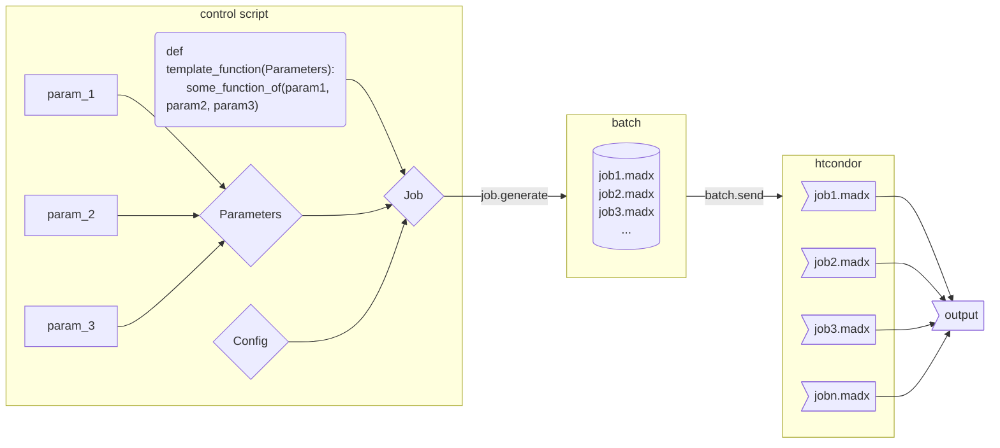

# cpymadBatch

A batching module to send MAD-X jobs to HTCondor.

```mermaid

flowchart LR
  subgraph control script
  direction LR
  config{Config}
    tem("def template_function(Parameters):
      some_function_of(param1, param2, param3)")
    style tem text-align: left
    param{Parameters}
    job{Job}
    tem --> job
    param --> job
    1[param_1]
    2[param_2]
    3[param_3]
    1 --> param
    2 --> param
    3 --> param
    config --> job
  end
  
  subgraph batch
  batches[("
  job1.madx
  job2.madx
  job3.madx
  ...
  ")]
  end

  subgraph htcondor
    direction TB
    j1>job1.madx]
    j2>job2.madx]
    j3>job3.madx]
    jn>jobn.madx]
  end
  
  job --job.generate--> batch --batch.send-->htcondor
  out>output]
  j1 --> out
  j2 --> out
  j3 --> out
  jn --> out

```